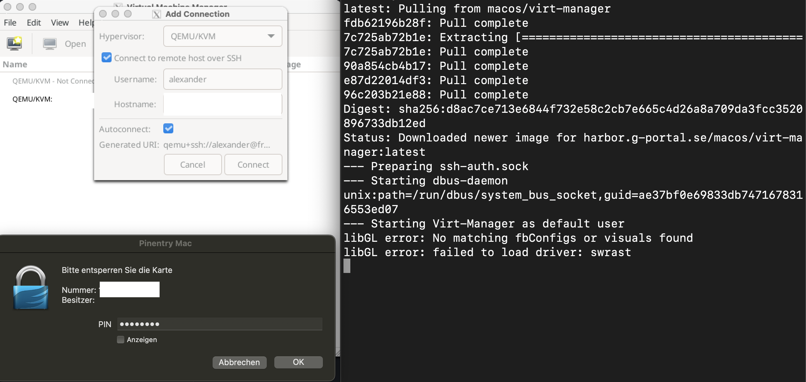
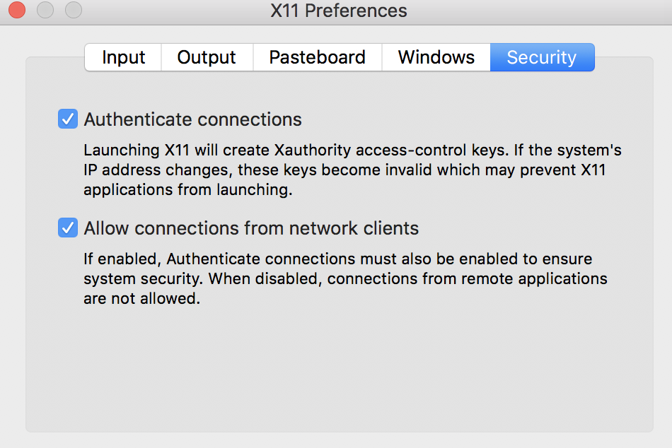

virt-manager on macOS
=====================

This is a Docker container for running virt-manager on macOS with the help of Docker and Xquartz.
It uses X11 forwarding to display the GUI on the host. Running virt-manager on macOS is not officially supported by the virt-manager project.
This is a workaround to get it running on macOS. 

It also supports SSH connections to remote hosts via GPG agent forwarding, e.g. using a Yubikey.

There were some packages on homebrew, but they are outdated and not working anymore. This
is why I created this Docker container which is based on the latest virt-manager version available on Fedora.

The pre-build container is available on Docker Hub: https://hub.docker.com/r/tyrola/virt-manager
It is available for x86_64 and arm64 (Apple Silicon) architectures.




### Requirements

- Docker Desktop for Mac
- XQuartz

### Installation

1. Install XQuartz via Homebrew or download from https://www.xquartz.org/
```bash
brew install --cask xquartz
```

2. Install Docker Desktop for Mac via Homebrew or download from https://www.docker.com/products/docker-desktop
```bash
brew install --cask docker
```

### Preparation

1. Open XQuartz
   - Open settings
   - Chose Security tab
   - Enable "Allow connections from network clients"



2. Allow localhost connection to X11
```bash
xhost +localhost
```

### Running

Start the container with following commands:

```bash
# Create Docker volume for storing virt-manager config
docker volume create virt-manager-config

# Run container
docker run -t -i --rm \
  -v virt-manager-cfg:/home/default/.config/:rw \
  --mount type=bind,src=/run/host-services/ssh-auth.sock,target=/run/host-services/ssh-auth.sock \
  --name virt-manager \
   tyrola/virt-manager:latest
```

### SSH Tunneling

If the remote host is using a local connection for QEMU, use an SSH tunnel to access the remote host.
Run this SSH tunnel outside of the docker container, on your local machine:

```bash
ssh -L 0.0.0.0:16509:127.0.0.1:16509 user@remotehost
```

This opens up a SSH tunnel from your local machine to the remote host. The remote libvirt
socket is running on `127.0.0.1:16509` in this example. Change ports if necessary.

Once the SSH socket is established, you can connect to the remote host from within the virt-manager container.
Use the following URI to connect to the remote host:

```bash
qemu+tcp://host.docker.internal:16509/system
```

The host.docker.internal address is a special DNS name that resolves to the internal
IP address of your workstation.